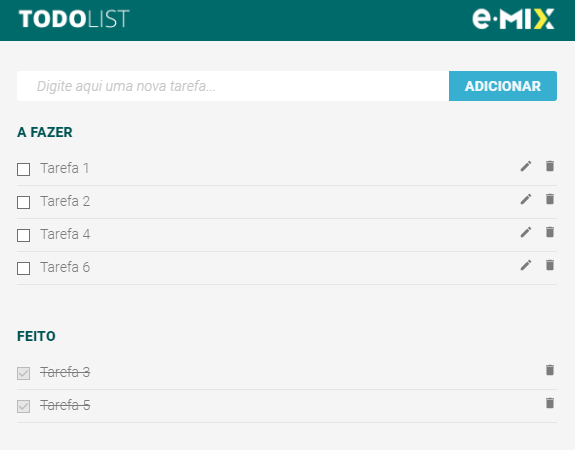

# To Do List e.Mix
> To Do List desenvolvida em um dos testes do processo seletivo da empresa [e.Mix](https://emix.com.br).

## Como utilizar

A aplicação está disponível [neste link](https://gustavogod.github.io/todolist-emix/).

A aplicação utiliza local storage para armazenamento da lista de tarefas adicionadas. Isto é, ao recarregar ou fechar e abrir a aba do navegador, as tarefas adicionadas permanecem como estão.

## 🛠 Tecnologias utilizadas:

- [ReactJS](https://reactjs.org)
- [Styled components](https://styled-components.com)
- [CSS](https://www.w3.org/TR/CSS/#css)
- [React Icons](https://react-icons.github.io/react-icons/)
- [React Hook Form](https://react-hook-form.com)

## 🧔 Autor
 

Feito por Gustavo Oliveira Dias 👋🏽

 

